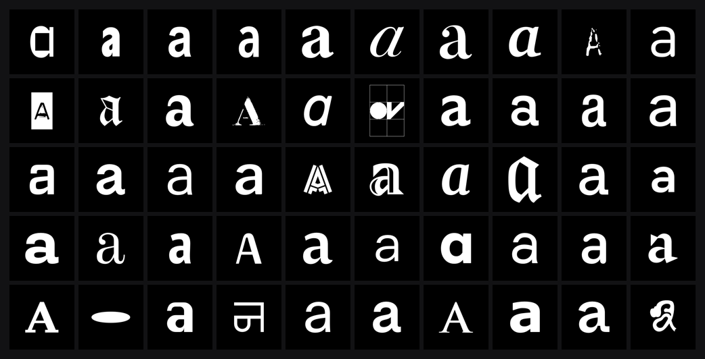

# macOS Fontface Scraper



Rasterizes a glyph from every font installed on your Mac into a folder of
grayscale PNGs, ready to use as machine learning training data.

There is nothing to install. Core Text and Core Graphics ship with macOS, so
the tool has no dependency to fetch, no Xcode project, and no runtime.
Scraping ~3,600 fonts at 256×256 takes about 3 seconds.

Intended for creative, non-commercial work. The fonts on your Mac are
licensed to you, not owned by you. Read [Licensing](#licensing) before you do
anything commercial with the output.

## Install

Download the prebuilt binary, no toolchain needed:

```sh
curl -fsSL https://github.com/latentcollection/macOS-fontface-scraper/releases/latest/download/fontscrape-macos-universal.tar.gz | tar -xz
./fontscrape
```

It is a universal binary, so it runs natively on both Apple Silicon and Intel,
back to macOS 11. Releases are built and published by CI from a tagged commit.

> [!NOTE]
> Downloading with `curl` is deliberate. macOS attaches its quarantine flag in
> the *downloading* application, which browsers do and `curl` does not, so the
> binary above just runs. If you fetch the release through a browser instead,
> Gatekeeper will block an unsigned binary until you either right-click it and
> choose Open, or clear the flag:
> `xattr -d com.apple.quarantine fontscrape`.

### Build from source

```sh
make
```

`make install` puts `fontscrape` on your `PATH` (honours `PREFIX`, default
`/usr/local`). `make universal` produces the two-architecture release binary in
`dist/`. Objects land in `build/`, the local binary at the repo root.

```
src/
├── main.mm          CLI parsing and orchestration
├── Options.h        flags, modes and every tunable constant
├── FontCatalog.mm   font discovery, traits, variable-font instances, capping
├── GlyphRenderer.mm layout, rasterization, PNG encoding
├── Manifest.mm      the CSV
└── TextUtil.mm      string, path and UTF-8 helpers
```

Each `.mm` has a paired header; `Options.h` is header-only.

## Usage

Run it with no arguments and it asks where your fonts are, defaulting to the
standard macOS font directories:

```sh
./fontscrape
```

Or drive it directly:

```sh
./fontscrape --glyph a --size 256 --out dataset/
./fontscrape --glyphs abcdefghijklmnopqrstuvwxyz --sizes 64,128 --out dataset/
./fontscrape --mode xheight --per-family 3 --manifest --out dataset/
```

| Flag | Default | |
|---|---|---|
| `--glyph <str>` | `a` | one glyph, written flat into `--out` |
| `--glyphs <list>` | | several glyphs, one subdirectory each |
| `--size <px>` | `256` | one size, written flat into `--out` |
| `--sizes <list>` | | several sizes, one subdirectory each |
| `--mode <m>` | `fit` | `fit`, `xheight` or `metric` |
| `--point-size <pt>` | `200` | font size, `metric` mode only |
| `--margin <frac>` | `0.10` | edge padding |
| `--xheight <frac>` | `0.34` | x-height as a fraction of canvas, `xheight` mode |
| `--out <dir>` | `out` | output directory |
| `--per-family <n>` | all | keep at most n faces per family, spread by weight |
| `--variations <n>` | `1` | sample n instances of each variable font |
| `--manifest` | off | also write `manifest.csv` of font metadata |
| `--license <text>` | | keep only faces whose embedded license matches |
| `--limit <n>` | `0` | cap images per glyph, `0` for all |
| `--invert` | off | black ink on white |
| `--list` | off | list matching fonts, render nothing |
| `--include-private` | off | include Apple's hidden system faces |
| `-y`, `--yes` | off | use defaults, never prompt |
| `-h`, `--help` | | usage, with every default |

Positional arguments are font directories or files, and replace the defaults.

## Modes

**`fit`** scales each glyph's ink to fill the canvas. Point size and x-height
differences are normalized away, leaving letterform shape.

**`xheight`** scales so every face shares an x-height, then centres the ink.
Width and stroke weight survive as signal. A compressed light and an extended
black stay recognisably different:

```
                       fit          xheight
GTAmerica-Compressed    91 × 205     41 × 91
GTAmerica-ExtendedBlack 205 × 173   110 × 93
```

**`metric`** renders at a fixed point size on a shared baseline, preserving
each font's absolute metrics.

## Sweeps

`--glyphs` takes one character per glyph (`--glyphs abc`), or a comma-separated
list when entries are longer than a character (`--glyphs a,Ag,%`). `--sizes` is
always comma-separated.

The plural flags always create a subdirectory per value, so `--glyphs a` gives
`out/a/` where `--glyph a` gives `out/`. Sizes nest outside glyphs:

```
out/
├── manifest.csv
├── 128/
│   ├── a/  Helvetica.png, Times-Roman.png, ...
│   └── b/  ...
└── 256/
    ├── a/  ...
    └── b/  ...
```

Pointing torchvision's `ImageFolder` at `out/256/` gives one class per glyph.
A sweep scans the font directories once and reuses the glyph lookup across
sizes, so it costs far less than running the tool per combination.

## Diversity

A font collection is much less varied than its file count suggests. On the
machine this was built for, 3,639 faces came from only 654 families. GT
America alone accounted for 70 of them, Minion Pro 64, Surt 54. Anything trained on that will be
skewed toward whichever families you happen to own the most weights of.

`--per-family <n>` caps it, choosing faces spread across the family's weight
range rather than in file order, so `--per-family 3` gives something like
UltraLight / Regular / Black:

```
none            3,639 images
--per-family 3  1,405
--per-family 1    653
```

`--variations <n>` goes the other way. Variable fonts carry continuous weight
and width axes, so this instantiates n points along one (preferring `wght`)
and renders each. These are real typefaces the designer specified rather than
affine copies of one bitmap, which makes them honest additional samples.

The two compose in that order: variations are generated first, then
`--per-family` caps whatever came out. The cap counts samples, not source
files, so a variable family can't smuggle extra weight through it. Combining
`--variations 4` with `--per-family 3` therefore keeps three images for that
family in total, not twelve.

## Manifest

`--manifest` writes `manifest.csv` alongside the images:

```csv
file,postscript_name,family,glyph,size,weight,width,slant,class,italic,bold,condensed,expanded,monospace,axis,axis_value
a/HelveticaNeueLTStd-Th.png,HelveticaNeueLTStd-Th,Helvetica Neue LT Std,a,256,-0.3150,0.0000,0.0000,unknown,0,0,0,0,0,,
a/ZapfinoExtraLT-SmallCaps.png,ZapfinoExtraLT-SmallCaps,Zapfino Extra LT,a,256,0.0000,0.0000,0.0000,script,0,0,0,0,0,,
```

`weight`, `width` and `slant` are Core Text's normalized traits, and `class` is
its own stylistic classification (`sans-serif`, `slab-serif`, `script`,
`ornamental`, and so on) rather than a guess from the font's name. Enough to
condition a model on style, not just on which letter it is.

The last four columns (`license`, `license_url`, `copyright`, `vendor`) come
from the font's own OpenType name table, so they are the vendor's text rather
than anything inferred.

## Licensing

> [!IMPORTANT]
> This is built for creative, non-commercial work: experiments, studies,
> generative typography, personal training runs. If you have commercial intent,
> stop and read the agreements covering the fonts you own before you scrape
> them. `--license` narrows the set to fonts that declare permissive terms
> themselves, but that is a convenience rather than clearance. A font may be
> permissively licensed and declare nothing, or declare something that still
> does not cover what you are planning. The tool cannot tell you which, and
> neither can this README. The MIT license on this repository covers the
> scraper's own source code and nothing it reads or produces.

Scraping is not the issue. The tool reads installed fonts through the
same Core Text APIs any application uses to draw text, and never copies,
embeds or redistributes a font file.

What you then do with the images is a separate question, and the answer
depends on where you are and what you publish. In the US, typeface *designs*
have never been copyrightable while the font *software* is, which puts a
raster image of a letterform on very different ground from the font file. The
UK, Germany and much of the EU do extend protection to the designs. On top of
that sits each foundry's own agreement, and some now address machine learning
explicitly.

Least to most exposed:

- Rendering glyphs locally and training something for yourself: no issue.
- Publishing the image set: you are redistributing derivative representations
  of fonts you licensed but do not own.
- Publishing a model trained on them: the law here is unsettled.

`--license` gives you a defensible subset. Fonts under the SIL Open Font
License carry that fact in their name table, and the OFL permits derivative
works, so:

```sh
./fontscrape --license OFL --manifest --out dataset/
```

On the machine this was built for that narrows 3,639 faces to 222, from
Velvetyne, Colophon, Bold Monday and similar. A much smaller set, but one with
a far clearer basis for publishing and for other people to reproduce.

Fonts that declare nothing are not thereby permissive; commercial foundries
usually leave the field empty and put their terms in a separate agreement.
The manifest records what each font claims so you can check rather than
assume. None of this is legal advice.

## Notes

Output is 8-bit grayscale PNG. Glyphs are black-and-white shapes, so colour
channels carry no information and lossy compression would put ringing
artifacts on every stem.

Files are named after the font's PostScript name, so samples stay traceable
to their source face.

A font is skipped rather than rendered when it has no glyph for the requested
character, or maps it to an empty outline. Glyphs are drawn by glyph ID, which
stops Core Text quietly substituting a different family and mislabeling the
sample.

Apple's private UI faces (`.SFNS`, `.PingFang`, and friends) are excluded by
default. They are near-duplicate optical grades rather than distinct
typefaces; pass `--include-private` if you want them.

`.ttc` and `.otc` collections are expanded to every face they contain, which
is how most of the macOS system fonts ship.

## Related

[glyph-gan](https://github.com/latentcollection/glyph-gan), a DCGAN trained on
this kind of output.
